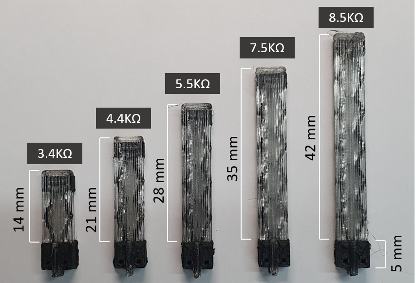
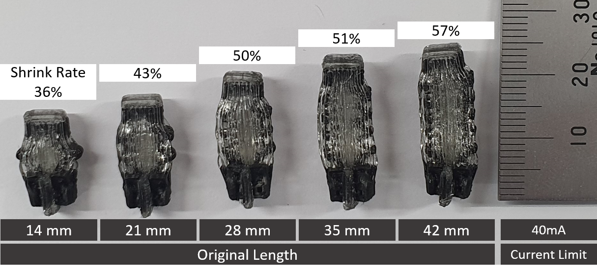

# ShrinkCells: Localized and Sequential Shape-Changing Actuation of 3D-Printed Objects via Selective Heating

This is the repository for the ShrinkCells Generator in Rhino3D used in the UIST 2022 paper "ShrinkCells: Localized and Sequential Shape-Changing Actuation of 3D-Printed Objects via Selective Heating". Additionally we included STL samples with power supply details. 

## Materials

Protopasta and SMP filament is used for this study
1) Protopasta https://www.proto-pasta.com/products/conductive-pla
2) SMP filament http://www.smptechno.com/index_en.html
   
## Slicer
Ultimaker Cura (https://ultimaker.com/software/ultimaker-cura) is used for this study, yet any slicer should work

## Power Supply details
Rhode&Schwarz NGA100 Series (https://www.rohde-schwarz.com/us/products/test-and-measurement/dc-power-supplies/rs-nga100-power-supply-series_63493-959872.html) is used for this study. However, any power supply with sufficient output power should be fine.

Incase you want to controll the power supply as we did in our study please refer to Rhode&Schwarz helper code (https://github.com/makinteractlab/RohdeSchwarzControlSoftware).

## Citation
When using or building upon this work in an academic publication, please consider citing as follows:

Kongpyung (Justin) Moon, Haeun Lee, Jeeeun Kim, and Andrea Bianchi. 2022. ShrinkCells: Localized and Sequential Shape-Changing Actuation of 3D-Printed Objects via Selective Heating. In The 35th Annual ACM Symposium on User Interface Software and Technology (UIST ’22), October 29-November 2, 2022, Bend, OR, USA. ACM, New York, NY, USA, 12 pages. https://doi.org/10.1145/3526113.3545670

## Contact
For questions please contact jkpmoon@kaist.ac.kr